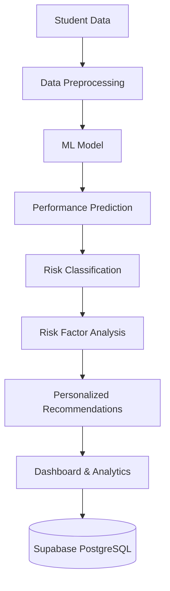

# AI-02 : Intelligence Student Performance Predictor

## Problem Statement

Develop an ML-based system that predicts a student's academic performance using parameters such as attendance, internal marks, assignment completion, previous semester performance, and study hours. The system should identify students who may be academically at risk and provide personalized recommendations.

## Team Members

Team Lead - Kalyana kumar M

Members:
- Dharun Raja VS
- kamalesh S

## Architecture

## Tech Stack

- **Frontend**: HTML5, CSS3, JavaScript (ES6+), Bootstrap 5, Chart.js, FontAwesome
- **Backend**: Python 3, Flask, Flask-CORS, Flask-Session
- **Machine Learning**: Scikit-learn (Linear Regression, Random Forest Regressor), Pandas, NumPy, Joblib
- **Database**: Supabase PostgreSQL, SQLite
- **Data Import**: OpenPyXL, Pandas

## Collaborators

1. kamaleshshanmugam19-ui
2. dharunrajavs
